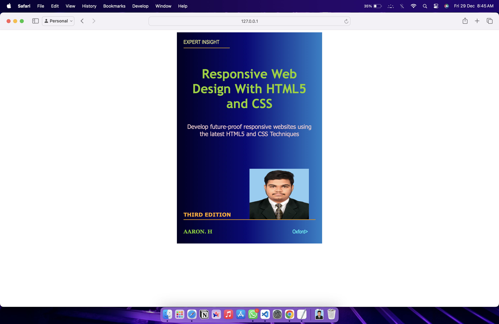

# Ex.06 Book Front Cover Page Design
## DATE: 22.11.2023
##  NAME: H. AARON
## Reference no: 23012368
## AIM:
To design a book front cover page using HTML and CSS.

## DESIGN STEPS:

### Step 1:
Create a Django Admin project.

### Step 2:
Create an app in the Django interface.

### Step 3:
Create a folder named 'static' in the app folder.

### Step 4:
Create a new HTML file in the static folder.

### Step 5:
Write the HTML code with relevant CSS properties.

### Step 6:
Choose the appropriate style and color scheme.

### Step 7:
Insert the images in their appropriate places.

### Step 8:
Publish the website in the LocalHost.

## PROGRAM:
```
<!DOCTYPE html>
<html lang="en">
    <head>
         <meta name="viewport" 
         content="width=device-width, initial-scale=1.0">
         <style>

        .bookpage{
            width: 400px;
            height: 600px;
            background: rgb(2,0,36); 
            background: linear-gradient(90deg, rgba(2,0,36,1) 0%, rgba(9,9,121,1) 35%, rgba(0,212,255,1) 100%);
            color:red;
            margin-left: auto;
            margin-right: auto;
            padding: 20px;
            font-family: 'Franklin Gothic Medium', 'Arial Narrow', Arial, sans-serif;
            background-size:600px;
        }
            

        .toptext{
            color:rgb(238, 242, 135);

        }

        
        .tophr{
            width:140px;
        }
        .author{
            color:rgb(114, 205, 9);
            display: inline;
            position: relative;
            top:190px;
            
            font-family:Georgia;
            font-size: medium;
        }
        .booktitle{
            font-family:'Trebuchet MS', 'Lucida Sans Unicode', 'Lucida Grande', 'Lucida Sans', Arial, sans-serif;
            font-size: larger;
            text-align: center;
            position: relative;
            color:rgb(142, 212, 12);
            top: 30px;
        
        }
        .id {
            width:400px;
            position: relative;
            top:180px;
            
        }
        .publisher{
            color: aqua;
            font-size: medium;
            position: relative;
            top:155px;
            left:330px;
        }
        .edition{
            color:orange;
            font-size: medium;
            font-family: Verdana;
            position:relative;
            top:85px;

        }
        .subtitle{
            font-family:'Segoe UI', Tahoma, Geneva, Verdana, sans-serif;
            font-size: large;
            text-align: center;
            position: relative;
            top:40px;
            color:rgb(245, 205, 205);
        }
        .photo{
            position: relative;
            top: 135px;
            left: 200px;
            width: 100px;
            height: 100px;
            background-size: cover;
        }
        </style>
        <title>Book Cover Page</title>
    </head>
    <body>
        <div class="bookpage">
            <div class="toptext">
                EXPERT INSIGHT
            </div>
            <div class="tophr">
                <hr style="color: rgb(172, 130, 51);">
            </div>
            <div class="booktitle">
                <h1>Responsive Web Design With HTML5 and CSS</h1></div>
            <div class="subtitle">
                Develop future-proof  responsive  websites  using  the  latest  HTML5  and  CSS  Techniques
            </div>
            <div>
        
            <div class="photo">
                
            </div>
            <div class="id">
                <hr style="color: orange;">
            </div>
            <div class="author">
               <p><b>AARON. H</b></p>
            </div>
            <div class="publisher">
                Oxford>
            </div>
            <div class="edition">
                <b>THIRD EDITION</b>
            </div>
            
        </div>
    </body>
</html>
```

## OUTPUT:

## RESULT:
The program for designing book front cover page using HTML and CSS is completed successfully.
